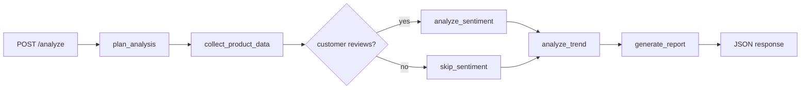

# DevIA Market Analysis Agent

LangGraph-based solution for the technical test **"Développeur IA : Agent d'analyse de marché e-commerce"**.

The implementation respects the brief:
- Code is limited to **steps 1 to 3**
- **Steps 4 to 7** are documented here
- The solution is runnable locally and through Docker
- The primary orchestration path is **LangGraph**
- A **native Python orchestrator** is kept as a comparison path

## 1. What is implemented

### Implemented in code
- `POST /analyze` REST endpoint
- `GET /health` endpoint
- LangGraph workflow with:
  - planning node
  - product data collection
  - conditional sentiment step
  - trend analysis
  - report generation
- 4 specialized tools:
  - product data tool
  - sentiment analyzer tool
  - market trend analyzer tool
  - report generator tool
- deterministic mocked market data for reproducible evaluation
- tool execution tracing and output metadata
- Docker packaging
- focused test suite for tools, orchestration, validation, and errors

### Deliberately not overbuilt
- External scrapers are mocked
- Persistence is documented, not implemented
- LLM synthesis is optional and disabled by default so the project runs offline

## 2. Architecture choice

### Why LangGraph
The assignment is primarily about **orchestration**. LangGraph is a strong fit because it makes the workflow explicit and keeps the solution easy to evolve toward:
- conditional routing
- retries
- subgraphs
- memory/checkpointing
- observability hooks

In this repo, LangGraph is used as the main execution engine. The graph includes a real conditional branch: if no customer reviews are provided, the agent skips the sentiment node and records that decision in the trace.

### Why keep a native orchestrator
The native orchestrator exists for two reasons:
- it shows the same business workflow without framework magic
- it makes trade-offs easy to discuss in review

Use it by setting `ORCHESTRATION_MODE=native`.

## 3. Project structure

```text
app/
  api/
    routes.py
  core/
    config.py
    errors.py
  models/
    schemas.py
  services/
    base_orchestrator.py
    factory.py
    langgraph_orchestrator.py
    native_orchestrator.py
    report_narrative.py
  tools/
    product_data_tool.py
    report_tool.py
    sentiment_tool.py
    trend_tool.py
  main.py
examples/
  sample_request.json
  sample_report.md
tests/
  test_api.py
  test_orchestrators.py
  test_tools.py
Dockerfile
docker-compose.yml
requirements.txt
README.md
```

## 4. Installation and usage

### Local run

Python 3.12 is the target runtime for this repo. The current code was validated in the local Python 3.12 environment and the Docker image now uses Python 3.12 as well.

```bash
python -m venv .venv
source .venv/bin/activate
pip install -r requirements.txt
uvicorn app.main:app --reload
```

### Docker run

Configure the container environment in `.env` first. For OpenAI-backed report synthesis, set:
- `OPENAI_API_KEY`
- `LLM_ENABLED=true`
- `REPORT_SYNTHESIS_MODE=openai_compatible`

```bash
docker compose up --build
```

### Health check

```bash
curl http://localhost:8000/health
```

### Run an analysis

```bash
curl -X POST http://localhost:8000/analyze \
  -H "Content-Type: application/json" \
  -d @examples/sample_request.json
```

## 5. Environment variables

| Variable | Default | Purpose |
|---|---|---|
| `ORCHESTRATION_MODE` | `langgraph` | `langgraph` or `native` |
| `REPORT_SYNTHESIS_MODE` | `template` | `template` or `openai_compatible` |
| `LLM_ENABLED` | `false` | enables the optional LLM summary path |
| `OPENAI_API_KEY` | unset | OpenAI API key; the app will use this directly |
| `LLM_API_KEY` | unset | API key for an OpenAI-compatible endpoint |
| `LLM_BASE_URL` | `https://api.openai.com/v1` | base URL for the compatible chat API |
| `LLM_MODEL` | `gpt-4o-mini` | model name for optional synthesis |
| `REQUEST_TIMEOUT_SECONDS` | `20` | outbound timeout for the optional LLM call |

### `.env` with Docker Compose

`docker-compose.yml` uses `env_file: .env`, so values from the repo-level `.env` file are injected into the container automatically.

Minimal OpenAI-enabled `.env`:

```dotenv
APP_ENV=local
ORCHESTRATION_MODE=langgraph
REPORT_SYNTHESIS_MODE=openai_compatible
LLM_ENABLED=true
OPENAI_API_KEY=sk-your-openai-key
LLM_BASE_URL=https://api.openai.com/v1
LLM_MODEL=gpt-4o-mini
REQUEST_TIMEOUT_SECONDS=20
```

### Optional LLM mode

The report generator can optionally use an OpenAI-compatible `chat/completions` endpoint for the executive summary and key findings. If the call fails, the system automatically falls back to the deterministic template path and records a warning.

That keeps the project aligned with the test's LLM/agent expectations without making the demo dependent on paid APIs.

## 6. API contract

### Endpoint

`POST /analyze`

### Example request

```json
{
  "product_name": "iPhone 15",
  "market": "CA",
  "competitors": ["Amazon", "Best Buy", "Walmart"],
  "include_recommendations": true,
  "customer_reviews": [
    "Great product and very reliable",
    "Premium feel but expensive",
    "Fast delivery and good quality"
  ]
}
```

### Response highlights

The response includes:
- `analysis_id`
- normalized request
- analysis plan
- collected product observations
- sentiment output
- market trend output
- generated report in markdown
- tool execution records
- trace of workflow steps
- warnings and metadata

## 7. LangGraph flow



## 8. Testing

Run:

```bash
pytest -q
```

The suite covers:
- individual tool outputs
- orchestration with and without sentiment
- output validation
- trend-analysis error handling
- API request validation

Current local result:

```text
12 passed
```

## 9. Example artifact

- Sample request: [examples/sample_request.json](examples/sample_request.json)
- Sample generated report: [examples/sample_report.md](examples/sample_report.md)

## 10. Notes for the evaluator

- The mocked market data is intentional. It keeps the demo deterministic and avoids spending time on brittle external scrapers.
- The orchestration layer is the main focus of the implementation, per the brief.
- The response is richer than a minimal demo so that debugging, evaluation, and future persistence are straightforward.

---

# Theoretical answers - steps 4 to 7

## 4. Data architecture and storage

### Recommended storage stack

I would use a hybrid storage design:
- **PostgreSQL** for analysis history, agent configuration, evaluation metadata, and reporting queries
- **Redis** for response caching, intermediate tool caches, locks, and short-lived execution state
- **Object storage** such as S3 or MinIO for generated report artifacts and raw snapshots

### Proposed logical schema

#### `analysis_requests`
- `id`
- `created_at`
- `product_name`
- `market`
- `request_payload`
- `orchestration_mode`
- `report_synthesis_mode`
- `status`
- `duration_ms`

#### `analysis_results`
- `id`
- `request_id`
- `executive_summary`
- `sentiment_label`
- `sentiment_score`
- `avg_price`
- `min_price`
- `max_price`
- `competitiveness`
- `demand_signal`
- `recommendations_json`
- `report_uri`

#### `tool_executions`
- `id`
- `request_id`
- `step_name`
- `tool_name`
- `status`
- `started_at`
- `ended_at`
- `duration_ms`
- `details_json`
- `error_message`

#### `agent_configs`
- `id`
- `name`
- `version`
- `is_active`
- `orchestrator_type`
- `model_provider`
- `model_name`
- `prompt_version`
- `tool_policy_json`

#### Redis keys
- request fingerprint -> full response cache
- product/market/seller fingerprint -> product data cache
- prompt fingerprint -> LLM synthesis cache
- execution lock keys for duplicate suppression

### Why this stack

PostgreSQL gives durable history and simple analytical queries. Redis handles low-latency caching and protects both throughput and cost. Object storage is the cheapest place for report artifacts and raw captures that are rarely updated.

## 5. Monitoring and observability

### Tracing

I would instrument each request and node execution with **OpenTelemetry** spans. For LLM-enabled runs, I would add **Langfuse** or equivalent model tracing to capture:
- prompt version
- model and provider
- latency
- token usage
- fallback events
- output quality tags

### Metrics to monitor

Infrastructure/runtime:
- request rate
- success rate
- p95 and p99 latency
- concurrent runs
- queue depth
- 4xx and 5xx error rates

Agent/tool metrics:
- tool failure rate by step
- retries per node
- cache hit rate
- fallback rate from LLM to template mode
- time spent in each node

LLM-specific metrics:
- input tokens
- output tokens
- cost per analysis
- invalid JSON rate
- timeout rate

Business/output metrics:
- report completeness score
- recommendation acceptance rate
- user feedback score
- factual consistency score from offline evaluations

### Alerting

I would alert on:
- sudden spike in 5xx responses
- latency regression beyond SLO
- rising trend-tool or product-tool failures
- unusually low cache hit rate
- abnormal cost per request
- increase in LLM fallback rate

## 6. Scaling and optimization

### Handling 100+ simultaneous analyses

I would separate the system into:
- stateless API layer
- queue or workflow layer
- autoscaled worker pool
- Redis
- PostgreSQL
- object storage

The API would accept requests quickly, enqueue work, and return a job identifier for longer-running analyses. Workers would run the LangGraph workflow asynchronously.

### Cost optimization for LLM usage

- cache prompt + context fingerprints
- use cheaper models for extraction/classification
- reserve stronger models for synthesis or edge cases
- summarize long contexts before sending them to premium models
- use confidence-based routing to avoid expensive calls when heuristics are enough

### Smart cache strategy

Cache at three layers:
1. product-market observations
2. intermediate tool outputs
3. full analysis response

TTL would vary by category. Fast-moving electronics should expire sooner than slower consumer goods.

### Parallelization opportunities

- fetch multiple seller observations concurrently
- analyze competitor slices in parallel
- separate LLM synthesis from deterministic aggregation when appropriate
- use LangGraph fan-out/fan-in patterns if the workflow grows

I kept the implementation simpler in code because the brief explicitly prioritizes clarity over unnecessary complexity.

## 7. Continuous improvement and A/B testing

### LLM as Judge

I would define a rubric with dimensions such as:
- factual consistency
- actionability
- completeness
- clarity
- business relevance

Each generated report would be scored automatically by a judge model against that rubric and compared to a baseline.

### Prompt experimentation

I would version:
- prompt template
- model name
- orchestration strategy
- toolset version
- fallback policy

Those versions would be stored on every analysis so results can be compared over time.

### User feedback loop

Useful feedback fields:
- useful / not useful
- missing information
- recommendation accepted / rejected
- free-text note

That feedback can be joined with request metadata to improve prompts, ranking heuristics, and tool routing.

### Safe evolution path

1. Build an offline benchmark dataset of representative product analyses.
2. Run nightly regression checks against the current champion workflow.
3. Ship challenger prompts/models to a small traffic slice.
4. Compare quality, latency, and cost.
5. Promote only when the challenger improves quality without unacceptable cost or reliability regressions.
