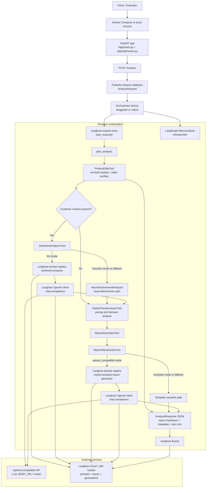

# Runtime Architecture

This diagram shows the full interaction flow of the solution when an analysis request runs, including FastAPI, orchestration, local tools, Langfuse, and the OpenAI-compatible provider path.

## What the graph means

- Every run starts at `POST /analyze`, where the request is validated and routed to either the LangGraph or native orchestrator.
- Product collection and trend analysis are always local and deterministic.
- Sentiment analysis is conditional: it is skipped when no reviews are provided.
- Sentiment can run in heuristic mode or in LLM mode, where the prompt is fetched from Langfuse and the generation is sent through the Langfuse OpenAI client.
- Report generation can stay on the local template path or use the OpenAI-compatible provider through a Langfuse-managed prompt.
- Langfuse is used for both observability and prompt management; failures in the LLM path fall back to the local deterministic path instead of failing the entire request.
